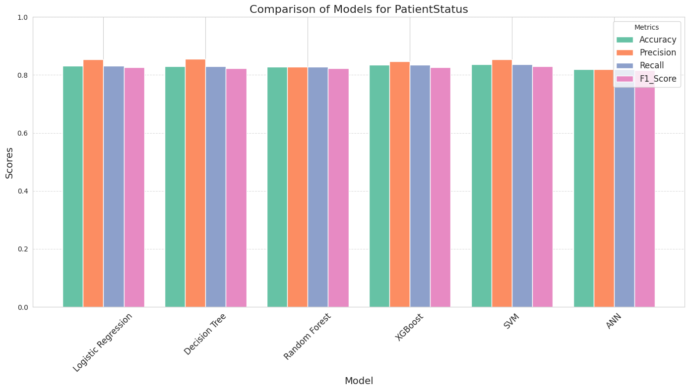
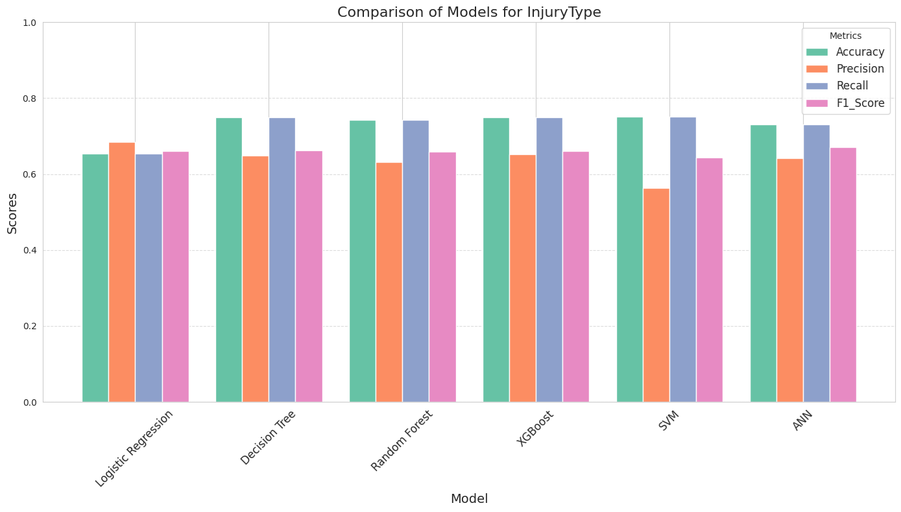
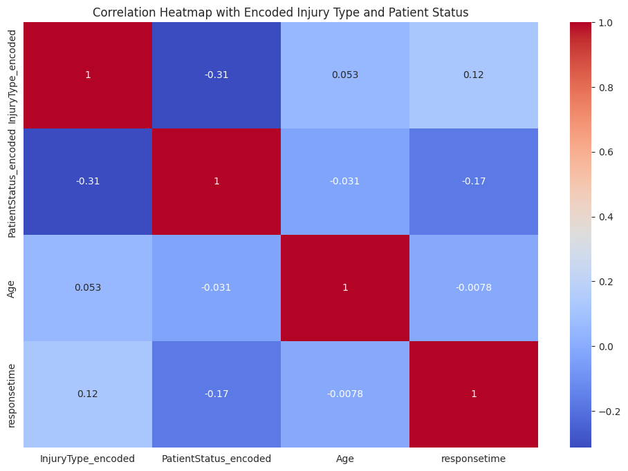
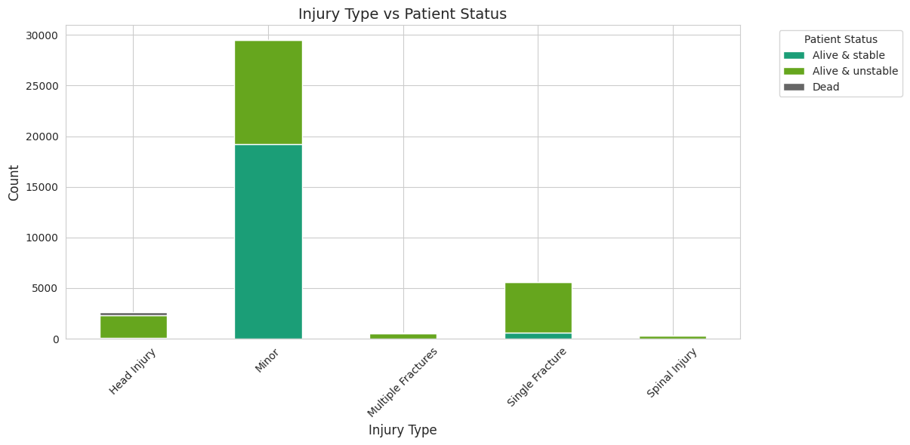

# Healthcare Data Classification: Patient Status & Injury Analysis

**A comprehensive machine learning pipeline predicting patient survival and injury severity from medical records. Features a rigorous benchmark of 6 algorithms (SVM, XGBoost, ANN) on raw healthcare data.**


[](Project_Report.pdf)

---

## 👥 Authors

- **Ahsan Rizvi**
- **Md. Tanvir Islam Shikdar**
- **Mahbuba Akter Neera** 

*Department of Electrical and Computer Engineering, North South University*


---

## 🏥 Project Overview

In emergency healthcare, rapid triage is critical. This project applies machine learning to **Road Traffic Accident (RTA)** data to automate two key diagnostic predictions:
1.  **Patient Status Prediction:** Binary classification (Alive vs. Deceased) to prioritize critical care.
2.  **Injury Type Prediction:** Multiclass classification to identify specific injury patterns (Severe, Minor, etc.).

We implemented an end-to-end data science pipeline—from raw data cleaning to hyperparameter tuning—benchmarking traditional ML models against Deep Learning approaches.

---

## 📂 Dataset Information
The repository includes the **raw dataset** used for this analysis.
* **File:** `RTA_Dataset.xlsx` 
* **Description:** Contains patient demographics, accident timestamps, vehicle details, and hospital admission info.
* **Preprocessing:** The notebook handles missing value imputation, timestamp extraction (Hour/Day/Month), and categorical encoding (One-Hot/Label).

---

## 📊 Key Results & Benchmarks

We compared **Logistic Regression, Decision Trees, Random Forest, XGBoost, SVM, and ANNs**.

### 1. Patient Status (Survival) Prediction
**Winner:** SVM (RBF Kernel) achieved **83.6% Accuracy**, outperforming deep learning models on this tabular data.


### 2. Injury Type Prediction
**Winner:** XGBoost achieved **81.2% Accuracy**, demonstrating superior handling of multiclass imbalances.


### 3. Data Insights
Our analysis revealed significant correlations between accident time, vehicle type, and injury severity.

<p float="left">
  
   
</p>

---

## 🛠️ Methodology

The project follows a standard industry lifecycle:
1.  **Data Cleaning:** Handling null values in `HospitalName` and removing outliers.
2.  **Feature Engineering:** Deriving temporal features from timestamps to capture "rush hour" accident trends.
3.  **Scaling:** Applied `StandardScaler` to normalize features for SVM and ANN stability.
4.  **Modeling:**
    * **Classical ML:** Logistic Regression, KNN, Decision Trees, Random Forest.
    * **Boosting:** XGBoost (Gradient Boosting).
    * **Deep Learning:** A 3-layer Artificial Neural Network (ANN) using TensorFlow/Keras.

---

## 🚀 How to Run

### 1. Prerequisites
* Python 3.8+
* Jupyter Notebook

### 2. Installation
Clone the repo and install dependencies:
```bash
git clone [https://github.com/ahsanrizvi99/healthcare-data-classification.git](https://github.com/ahsanrizvi99/healthcare-data-classification.git)
pip install -r requirements.txt

```

### 3. Run the Analysis

Launch the notebook. It is configured to load the raw dataset directly.

```bash
jupyter notebook notebooks/Healthcare_Classification_Analysis.ipynb

```

---

## 📂 Repository Structure

```text
/Healthcare-Data-Classification
│
├── /notebooks
│   └── Healthcare_Classification_Analysis.ipynb  # Main pipeline code
│
├── /assets                   # Comparison charts & heatmaps
│   ├── model_comparison_status.png
│   ├── model_comparison_injury.png
│   ├── correlation_heatmap.png
│   └── injury_status_distribution.png
│
├── RTA_Dataset.xlsx           # Raw Dataset (Included)
├── Project_Report.pdf        
├── requirements.txt          # Dependencies
└── README.md                 # Documentation

```

---

## 📜 License

This project is open-source and available under the **MIT License**. You are free to use, modify, and distribute this project with proper attribution.

